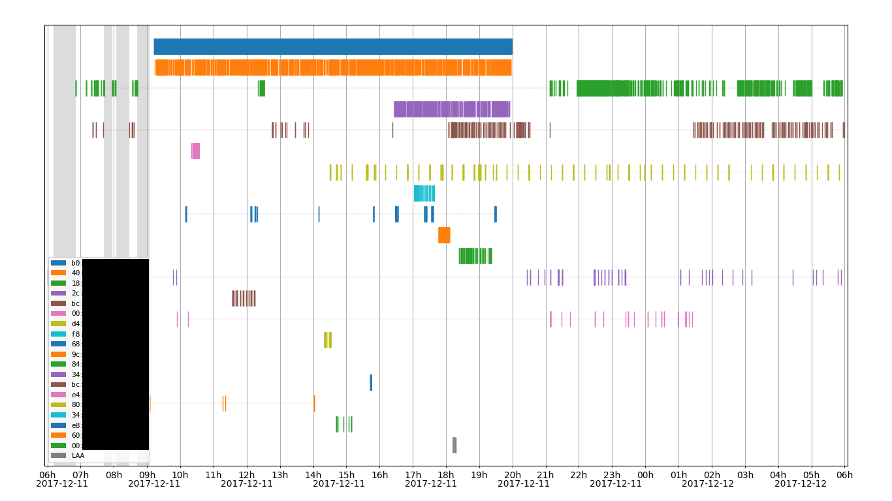

*all your probe requests belong to us*

# probemon
*probemon* is a simple command line tool for logging data from 802.11 probe request frames with  additional tools to plot mac presence over time and get statistics.

This rewritten version of *probemon* uses an sqlite3 DB like in *probeSniffer*, as the log can quickly grow over time. It does not hop on channels as you lose more traffic by hopping than by simply staying on a major channel (like 1, 6, 11).

There is a **flask app** `mapot.py` to serve charts/plots and stats of the sqlite3 db, in real time. An alternative is to use the other provided python tools: `plot.py` and `stats.py`.

The dependencies are:
* for probemon.py: scapy, manuf, lru-dict
* for mapot.py: flask, flask-caching
* for stats.py: None
* for plot.py: matplotlib, cycler

## probemon.py
You must enable monitor mode on your interface before running `probemon.py`. You can use, for example, `airmon-ng start wlan0` where wlan0 is your interface name. Now, use *wlan0mon* with `probemon.py`.

```
usage: probemon.py [-h] [-c CHANNEL] [-d DB] [-i INTERFACE] [-I IGNORE] [-s]
                   [-v]

a command line tool for logging 802.11 probe request

optional arguments:
  -h, --help            show this help message and exit
  -c CHANNEL, --channel CHANNEL
                        the channel to listen on
  -d DB, --db DB        database file name to use
  -i INTERFACE, --interface INTERFACE
                        the capture interface to use
  -I IGNORE, --ignore IGNORE
                        mac address to ignore
  -s, --stdout          also log probe request to stdout
  -v, --version         show version and exit
```

#### Note about non utf-8 SSID
For SSID that we can't decode in utf-8, we can't store them as is in the db. So we encode them in base64 and store prepended with `b64_`.

#### in C too
There is a C implementation of *probemon* in the `c.d` directory. It is almost complete and has the same features as the python script.

## mapot.py
A flask *app* to serve in real time the charts and probe requests stats.

You can run the *app* with:

    python mapot.py

More details in the [README.md](src/www/README.md) in `src/www`

## Other tools

- the `plot.py` script simplifies the analysis of the recorded data by drawing a chart that plots the presence of
mac addresses via the recorded probe request.

  
  When displayed by the script, one can hover the mouse on the plot to get the mac address, and the timestamp.
When you export to an image, you lose that feature but you can add a legend instead.


 - the `stats.py` script allows you to request the database about a specific mac address and get statistics about it,
or filter based on a RSSI value. You can also specify the start time and end time of your request.

## Locally Administered Addresses

> A locally administered address is assigned to a device by a network administrator, overriding the burned-in address.

> Universally administered and locally administered addresses are distinguished by setting the second-least-significant bit of the first octet of the address. This bit is also referred to as the U/L bit, short for Universal/Local, which identifies how the address is administered.
(source Wikipedia)

These type of MAC addresses are used by recent various OS/wifi stack to send probe requests anonymously, and using at the same time randomization.

So it defeats tracking and render probemon useless in that case. But not all devices are using this randomization technique, yet.

## Device behavior
It should be noted that not all devices are equal. They vary a lot in behavior regarding of the probe requests (PR). This should be taken into account when analyzing the data collected.

Depending on the type of device (PC/laptop/..., printer, mobile phone/tablet, IoT device), the OS used (Linux, Windows, Android, MacOS/iOS, unknown embedded OS, ...) the wifi chipset and/or the wifi/network stack, one device behave differently from one another when sending probe request.

Even phone using the same OS like android, can behave differently: some send PR every 30 seconds, while others only send PR when the screen is unlocked.

# Legality

I am not a lawyer and I can't give you any advice regarding the law.
But it might not be legal to collect and store probe requests in your country.

Even simply listening to probe requests might not be legal. For example, given the interpretation of *Section 18 U.S. Code § 2511*, it might not be legal to intercept the MAC addresses of devices in a network (?) or in the vicinity (?) in the U.S.A.

In Europe, if you are operating as a business, storing MAC addresses, which are considered private data, might be subject to the *GDPR*.

This is only straching the surface of the legality or illegality of this software.

Use with caution.
